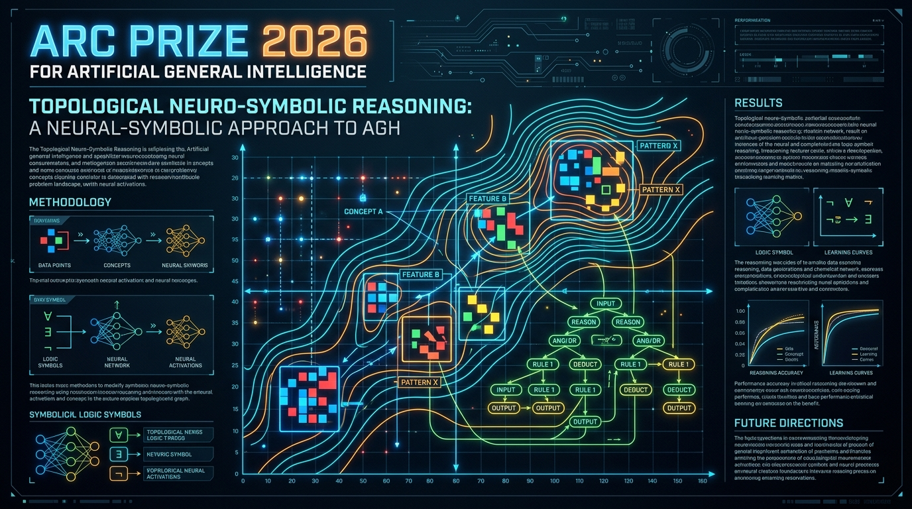
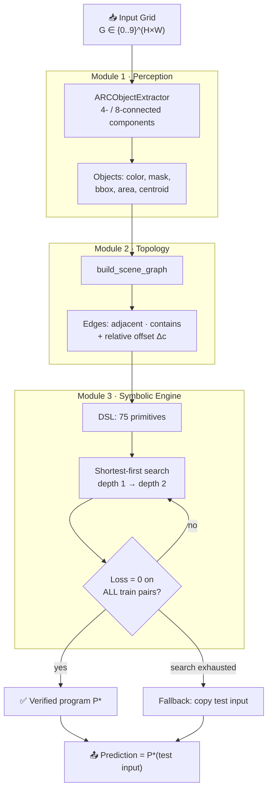
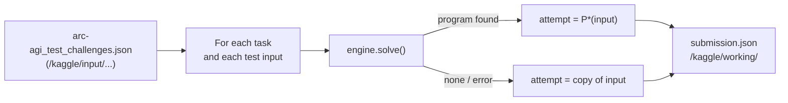

<div align="center">

# 🧠 Topological Neuro-Symbolic Engine (T-NSE)

### Object-Centric Spatial Induction for the Abstraction and Reasoning Corpus

**Kaggle ARC Prize 2026 · ARC-AGI-2 · Paper Track**

[](https://colab.research.google.com/github/emersonnjsantos/Arq_Neuro-Simbolic_Espacial_Topologico_ARC/blob/main/Neuro-Simbolic_Espacial_Topologico_ARC.ipynb)
[](https://www.kaggle.com/competitions/arc-prize-2026-arc-agi-2)




*Perceive objects. Reason over topology. Synthesize verified programs.*

</div>

---

## 📑 Table of Contents

1. [About the Competition](#-about-the-competition)
2. [The Core Problem](#-the-core-problem)
3. [Our Approach: T-NSE](#-our-approach-t-nse)
4. [System Architecture](#️-system-architecture)
5. [Module Deep-Dive](#-module-deep-dive)
6. [Search Complexity](#-search-complexity)
7. [Empirical Results](#-empirical-results)
8. [Kaggle Submission Pipeline](#-kaggle-submission-pipeline)
9. [Quick Start](#-quick-start)
10. [Repository Structure](#-repository-structure)
11. [Limitations (Honest Scope)](#️-limitations-honest-scope)
12. [Roadmap](#️-roadmap)
13. [Citation & License](#-citation--license)

---

## 🏆 About the Competition

The **ARC Prize 2026** is a Kaggle competition built on **ARC-AGI-2**, the second generation of the *Abstraction and Reasoning Corpus* introduced by François Chollet in *On the Measure of Intelligence* (2019).

ARC does not measure *skill*; it measures **skill-acquisition efficiency**: how quickly a system learns a brand-new rule from a handful of examples, without task-specific pre-training. Every evaluation task is **novel**, so memorizing patterns does not work.

### How a task looks

Each task is a JSON object with a few **demonstration pairs** (`train`) and one or more **test inputs** (`test`). Grids range from `1×1` to `30×30`, and each cell is an integer `0–9` (one of 10 colors).

```json
{
  "train": [
    { "input": [[0,7,7],[7,7,7],[0,7,7]], "output": [[0,0,0,0,7,7,0,7,7], "..."] },
    { "input": [[4,0,4],[0,0,0],[0,4,0]], "output": [[4,0,4,0,0,0,4,0,4], "..."] }
  ],
  "test": [
    { "input": [[7,0,7],[7,0,7],[7,7,0]] }
  ]
}
```

The solver must build the **entire output grid**: its height, its width, and the color of every cell.

### Scoring rules

| Rule | Detail |
|---|---|
| **Attempts** | 2 attempts (`attempt_1`, `attempt_2`) per test input |
| **Correctness** | Exact match only: every cell and the grid shape must be right |
| **Score** | Fraction of test outputs solved by at least one attempt |
| **Hidden test set** | ~240 tasks, run offline (no Internet) under strict time limits |

### The Paper Track

Besides the leaderboard, the **Paper Track** rewards *ideas*: conceptual and technical contributions to abstract reasoning. Papers are judged on **Accuracy, Universality, Progress, Theory, Completeness and Novelty**. To be eligible, the same team must also have a **valid submission** in the main ARC-AGI-2 competition, and the code must be open source.

This repository is our Paper Track entry.

---

## 🧩 The Core Problem

Current AI paradigms fail on ARC for opposite reasons:

| Paradigm | Strength | Why it fails on ARC |
|---|---|---|
| **LLMs / VLMs** | Broad priors, fluent generation | Grids are serialized into 1-D tokens, which destroys 2-D locality → *spatial blindness* and hallucinated coordinates |
| **Pure program synthesis** | Exact, verifiable | Search space grows as $\mathcal{O}(\lvert\mathcal{D}\rvert^{L})$ → *combinatorial explosion* beyond a few steps |

Humans, by contrast, solve most ARC tasks in seconds. They rely on **Core Knowledge priors** (Spelke; Chollet):

- 🧱 **Objectness & cohesion**: contiguous same-colored pixels move together as one entity.
- 🕳️ **Topological invariants**: connectivity, holes and containment survive translation and recoloring.
- 🎯 **Goal-directed morphisms**: outputs are structured transformations of identified objects.

**T-NSE encodes these priors directly into its representation**, so the search runs over *objects and relations* instead of raw pixels.

---

## 💡 Our Approach: T-NSE

T-NSE splits visual reasoning into three complementary stages:

1. **Perceptual Objectification**: decompose the grid into discrete objects (mask, bounding box, centroid, mass) with configurable 4- or 8-connectivity.
2. **Topological Scene Graph (TSG)**: build a relational graph of adjacency, containment (holes/cavities) and relative offsets.
3. **Verified Program Synthesis**: search a compact, typed DSL and accept a program **only** when it reproduces **every** training output exactly ($\text{Loss} = 0$).

The result is a solver that is **explainable** (it outputs an explicit program), **sample-efficient** (it learns from 1–5 examples) and **deterministic** (no stochastic guessing at test time).

---

## 🏗️ System Architecture



---

## 🔬 Module Deep-Dive

### Module 1 · Topological Perception (`ARCObjectExtractor`)

A grid $\mathbf{G} \in \{0,\dots,9\}^{H \times W}$ is segmented, color by color, into objects:

$$o_i = \langle\, c_i,\ \mathcal{M}_i,\ \mathbf{b}_i,\ A_i,\ \mathbf{c}_i \,\rangle$$

| Symbol | Meaning |
|---|---|
| $c_i \in \{1,\dots,9\}$ | color label (0 is background) |
| $\mathcal{M}_i \in \{0,1\}^{H\times W}$ | exact binary support mask |
| $\mathbf{b}_i = (x, y, w, h)$ | minimal axis-aligned bounding box |
| $A_i = \sum \mathcal{M}_i$ | pixel mass |
| $\mathbf{c}_i = (\bar{x}, \bar{y})$ | centroid |

```python
objs = ARCObjectExtractor(grid, connectivity=4).extract_features()
```

- **Connectivity is a parameter**: with `4` diagonal pixels are separate objects; with `8` they merge. The right choice depends on the task.
- **Dependency-light**: labeling uses `cv2.connectedComponents` when OpenCV is installed and falls back to an equivalent pure-NumPy BFS otherwise.

### Module 2 · Topological Scene Graph (`build_scene_graph`)

The scene becomes an attributed graph $\mathcal{G} = (\mathcal{V}, \mathcal{E})$ where nodes are objects and edges are typed relations:

| Relation | Definition |
|---|---|
| `contains` | object $j$ lies entirely inside a **hole** of object $i$ |
| `adjacent` | the masks touch orthogonally ($\text{dist} \le 1$) |
| `delta` | relative centroid vector $\Delta\mathbf{c}_{ij} = \mathbf{c}_j - \mathbf{c}_i$ |

**Holes** are computed topologically by `enclosed_cells`: a flood-fill from the grid border marks every background cell reachable from outside; whatever remains unreached is an enclosed cavity. Each node also stores its `n_hole_cells`, a discrete analogue of the Euler characteristic.

### Module 3 · Symbolic Engine & DSL (`ARCSymbolicEngine`)

A compact, typed **grid → grid** DSL with **75 primitives**:

| Family | Primitives | Count |
|---|---|:---:|
| **Affine ($\mathcal{D}_4$ group)** | `rot90`, `rot180`, `rot270`, `flip_h`, `flip_v`, `transpose` | 6 |
| **Structural** | `fractal_self_tile` (Kronecker self-similarity), `upscale(k)` for k ∈ {2, 3} | 3 |
| **Topological** | `fill_holes(c)`: fills enclosed cavities with color c ∈ 1..9 | 9 |
| **Palette** | `recolor_all(c)`: recolors every foreground pixel | 9 |
| **Geometric** | `translate(dx, dy)` for dx, dy ∈ [−3, 3] | 48 |

Two primitives are worth highlighting because they are one-liners in linear algebra:

```python
def fractal_self_tile(grid):            # each foreground cell becomes a copy of the grid
    g = np.array(grid, dtype=np.uint8)
    return np.kron((g != 0).astype(np.uint8), g)

def upscale(grid, k):                   # nearest-neighbour k× magnification
    return np.kron(np.array(grid, dtype=np.uint8), np.ones((k, k), dtype=np.uint8))
```

#### Induction & deterministic verification

For training pairs $\{(I_k, O_k)\}_{k=1}^{K}$, every candidate program $P$ is executed and scored:

$$\text{Loss}(P) = \sum_{k=1}^{K} \big\lVert P(I_k) - O_k \big\rVert_0 \qquad (\text{shape mismatch} \Rightarrow \infty)$$

Programs are enumerated **shortest first** (Occam's razor / minimum description length). The first $P^\star$ with $\text{Loss}(P^\star) = 0$ is applied to the test input:

$$O_{\text{test}} = P^\star(I_{\text{test}})$$

```python
engine = ARCSymbolicEngine()
program, prediction = engine.solve(train_pairs, test_input, max_depth=2)
# program found: fractal_self_tile  (depth 1, 7 candidates tested)
```

---

## 📐 Search Complexity

| Depth | Candidates | Cumulative |
|:---:|---:|---:|
| 1 | 75 | 75 |
| 2 | 75² = 5,625 | 5,700 |
| 3 *(not enabled)* | 75³ = 421,875 | 427,575 |

Pixel space for a `30×30` grid has $10^{900}$ configurations. By working with object-level morphisms, T-NSE reduces the effective search to **at most ~5.7 × 10³ verified programs** per task. Exponential growth with depth is still the main bottleneck, which is why learned pruning is the top roadmap item.

---

## 📊 Empirical Results

| Benchmark | Result |
|---|---|
| **Official ARC task `007bbfb7`** | Synthesizes `fractal_self_tile` from **5/5** training pairs (Loss = 0) after **7** candidates; the hidden test output is predicted **exactly** ✅ |
| **Synthetic: rotate 90°** | Recovered at depth 1 ✅ |
| **Synthetic: horizontal mirror** | Recovered at depth 1 ✅ |
| **Synthetic: fill holes with 3** | Recovered at depth 1 ✅ |
| **Synthetic: recolor to 5** | Recovered at depth 1 ✅ |
| **Synthetic: `rot90 → flip_h`** | Recovered at depth 2 (composition) ✅ |
| **Offline robustness** | Loader falls back from local Kaggle input → GitHub → embedded copy ✅ |

> [!NOTE]
> These results validate the *mechanism*. We do **not** claim a leaderboard score; the Accuracy criterion should be read against the linked Kaggle Submission ID.

### Why T-NSE vs. alternatives

| Dimension | Pure LLM / VLM | Pure DSL brute force | **T-NSE** |
|---|---|---|---|
| Spatial grounding | Poor (hallucinated coordinates) | Exact (pixel level) | **Exact (object + graph level)** |
| Verification | Stochastic | Deterministic | **Deterministic on all train pairs** |
| Sample efficiency | Needs heavy pre-training | 2–3 examples | **1–5 examples** |
| Interpretability | Opaque attention | Explicit program | **Explicit program + scene graph** |

---

## 🚀 Kaggle Submission Pipeline

**Module 5** of the notebook turns the engine into a valid ARC-AGI-2 submission:



Output format (one dict **per test input**, because some tasks have 2+ test inputs):

```json
{
  "00576224": [
    { "attempt_1": [[0, 0], [0, 0]], "attempt_2": [[0, 0], [0, 0]] }
  ],
  "009d5c81": [
    { "attempt_1": [[0, 0], [0, 0]], "attempt_2": [[0, 0], [0, 0]] },
    { "attempt_1": [[0, 0], [0, 0]], "attempt_2": [[0, 0], [0, 0]] }
  ]
}
```

Built-in safety guarantees:

- 🛡️ **Per-task `try/except`**: one failing task never breaks the whole file.
- 📦 **Every task gets an entry**: a missing task ID would invalidate the submission.
- 🌐 **No Internet required**: matches Kaggle's offline evaluation.

> [!IMPORTANT]
> **Current submission setting: `max_depth=0`.** Brute-force search at depth 2 over ~240 hidden tasks exceeded Kaggle's runtime limit and caused a *Submission Scoring Error*. To obtain a valid Submission ID (required for Paper Track eligibility), the submission cell currently runs with `max_depth=0`. In this mode **no search is performed** and every attempt is the identity fallback. The full depth-2 engine is still demonstrated in Modules 3–4. Re-enabling `max_depth=1` (75 candidates per task) with a per-task time budget is the next step.

---

## ⚡ Quick Start

### Option A · Google Colab (zero setup)

Click the badge and choose **Runtime → Run all**:

[](https://colab.research.google.com/github/emersonnjsantos/Arq_Neuro-Simbolic_Espacial_Topologico_ARC/blob/main/Neuro-Simbolic_Espacial_Topologico_ARC.ipynb)

Outside Kaggle, Module 5 prints `Kaggle test data not found. Falling back to the embedded task for demonstration.` This is expected: it solves the embedded task `007bbfb7` and writes a 1-task `submission.json`.

### Option B · Kaggle (official submission)

1. Create a new notebook and import `Neuro-Simbolic_Espacial_Topologico_ARC.ipynb`.
2. **Add Input →** the *ARC Prize 2026 – ARC-AGI-2* competition dataset.
3. **Settings →** turn **Internet off**.
4. **Save Version → Save & Run All (Commit)**.
5. Open the **Output** tab and click **Submit to Competition**.

### Option C · Local

```bash
git clone https://github.com/emersonnjsantos/Arq_Neuro-Simbolic_Espacial_Topologico_ARC.git
cd Arq_Neuro-Simbolic_Espacial_Topologico_ARC
python -m venv .venv
# Windows: .venv\Scripts\activate   |   Linux/macOS: source .venv/bin/activate
pip install numpy jupyter opencv-python   # OpenCV is optional
jupyter notebook Neuro-Simbolic_Espacial_Topologico_ARC.ipynb
```

---

## 📁 Repository Structure

```text
.
├── Neuro-Simbolic_Espacial_Topologico_ARC.ipynb   # Main notebook: Modules 1–5
├── SUBMISSION_ARC_PRIZE_2026_REPORT.md            # Paper Track technical report
├── PAPER_ARC_PRIZE_2026_ALIGNED.txt               # Paper aligned with the judging criteria
├── GUIA_SUBMISSAO_KAGGLE_ARC_2026.md              # Kaggle submission guide (Portuguese)
├── submission.json                                # Sample output generated by Module 5
├── cover_image_arc_prize_2026.jpg                 # Cover image
└── README.md                                      # You are here
```

| Notebook section | Purpose |
|---|---|
| Module 1 | `ARCObjectExtractor`: object perception with 4/8-connectivity |
| Module 2 | `build_scene_graph`: topological relations and hole detection |
| Module 3 | `ARCSymbolicEngine`: DSL, loss, shortest-first synthesis |
| Module 4 | Validation on the official ARC task `007bbfb7` |
| Module 5 | Kaggle ARC-AGI-2 `submission.json` generator |

---

## ⚠️ Limitations (Honest Scope)

This is a **reference prototype**, not a leaderboard-optimized system:

- The DSL is small (75 primitives); most ARC-AGI-2 tasks require rules outside it.
- Search is **brute force**, limited to depth ≤ 2.
- The **neural pruning module** described in the report is **not yet implemented**.
- Both attempts are identical (single hypothesis); the second attempt is not yet used for a runner-up program.
- The Kaggle submission currently runs with `max_depth=0` (see [Pipeline](#-kaggle-submission-pipeline)).

---

## 🗺️ Roadmap

- [x] Object-centric perception with configurable connectivity
- [x] Topological Scene Graph (adjacency, containment, offsets)
- [x] Typed DSL with deterministic multi-pair verification
- [x] Offline-safe, valid ARC-AGI-2 `submission.json`
- [ ] Per-task time budget so depth-1/2 search fits Kaggle limits
- [ ] Use `attempt_2` for the second-best program (beam of 2)
- [ ] **TSG-delta pruning**: pick DSL families from input/output graph differences
- [ ] **GNN heuristic** over the scene graph to rank candidate programs
- [ ] Object-level primitives (per-object recolor/move, gravity, crop-to-object)
- [ ] Recursive cellular automata and dynamic flood fills
- [ ] Extension to interactive **ARC-AGI-3** environments

---

## 🌍 Beyond ARC

T-NSE is a general recipe for **object-centric relational world modeling**:

- 🤖 **Robotics**: synthesize manipulation sequences from visual demonstrations.
- 📐 **CAD & floor-planning**: enforce containment, clearance and routing constraints.
- 🧪 **Physical commonsense**: predict containment, support and trajectories.

---

## 📚 Citation & License

```bibtex
@misc{santos2026tnse,
  title  = {Topological Neuro-Symbolic Engine (T-NSE): Object-Centric Spatial Induction for ARC-AGI},
  author = {Santos, Emerson Noé José dos},
  year   = {2026},
  note   = {Kaggle ARC Prize 2026 -- Paper Track},
  url    = {https://github.com/emersonnjsantos/Arq_Neuro-Simbolic_Espacial_Topologico_ARC}
}
```

**References**

- F. Chollet. *On the Measure of Intelligence*. arXiv:1911.01547, 2019.
- E. S. Spelke & K. D. Kinzler. *Core Knowledge*. Developmental Science, 2007.
- ARC Prize Foundation. *ARC-AGI-2 benchmark*. [arcprize.org](https://arcprize.org)

Released under **[Creative Commons Attribution 4.0 (CC BY 4.0)](https://creativecommons.org/licenses/by/4.0/)**, as required by the ARC Prize 2026 open-source rules.

<div align="center">

---

**Author:** Emerson Noé José dos Santos  
*If this project helped you think about abstract reasoning, consider giving it a ⭐*

</div>
